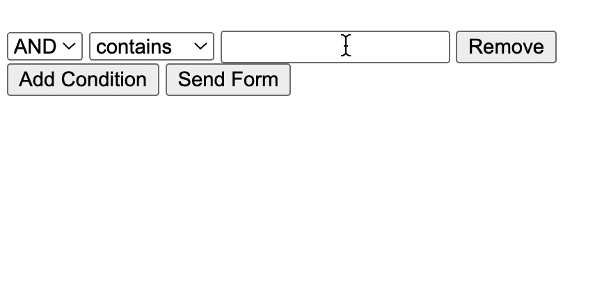

# flask-das
An implementation of a dynamic advanced search based on Flask, Flaks-wtf and Vanilla Javascript.



## Getting started
This repository is not a module but an example of a possible implementation to test it:

```
git clone https://github.com/giacomomarchioro/flask-das
cd /pathto/flask-das
flask run
```


## Acknowledgments
This [blog post from
Rafael Medina](https://www.rmedgar.com/blog/dynamic-fields-flask-wtf/)  helped me in the creation of the dynamic form.